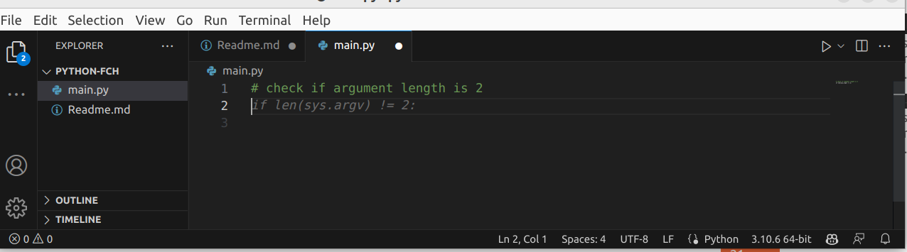
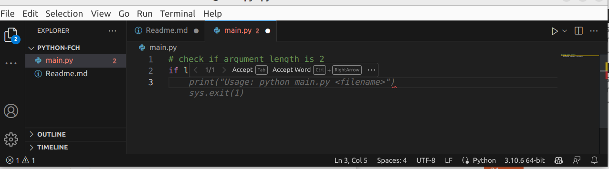
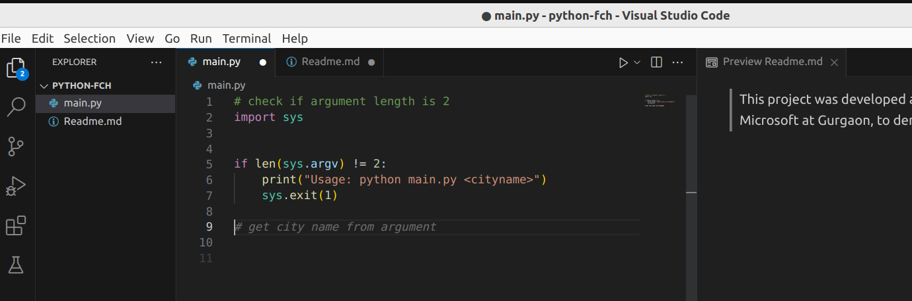
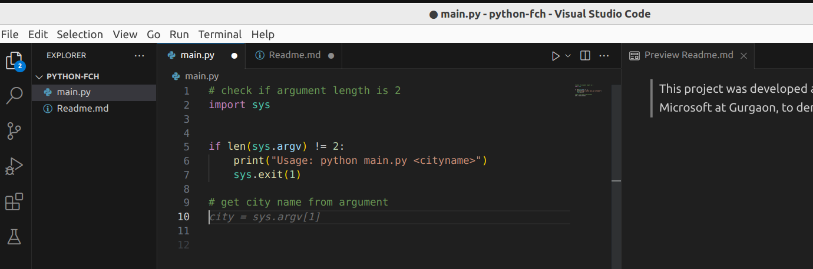
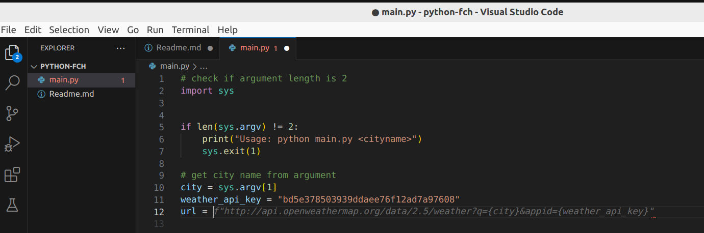

### This project was developed at Fastest Coder Hackathon organized by Microsoft at Gurgaon, to demonstrate the use of Github Copilot.

---

# Prerequisite
* VSCode
* GitHub Copilot extension for VSCode
* Python3
* Python extension for VSCode

# Problem Statement
To demonstrate the use of GitHub Copilot, to build a command line tool/application using python, which takes city as a input on command line and fetch the weather data from open weather api, and print on terminal.

# Hackathon Story
Checking for command argument, calling the weather api, parsing response and displaying information is too straight forward that it can be achieved without copilot in less than an hour.

So I thought to play with it for sometime, which also allowed me sometime to think of how I can differentiate my solution from others.

While playing with it, I found that Copilot not only provides accurate solutions step by step, but also learns your expection as you edit the code, will talk more on  (how?) about this later.

# What is implemented?
So I decided that instead of printing the figures i.e., Temperature, Humidity, Wind speed, etc., on the screen, which will be of no use for a layman (i.e., the one who don't understand mesurement metrics - fahrenheit, etc.,), It would be better if the program simply says "Its Warm", "Its Hot", "Its Cold", "Its Rainy", etc.

# Implementation Walkthrough
Create a folder with any name mine is named "python-fch".

Create a python file i.e., main.py, and open the file in VSCode.
Now we are ready to interact with copilot to write code.

To interact with copilot and get code suggestion, we start with writing comments, in python the comment starts with "#".

So the very first line in the main.py we type below line.

```# check if argument length is 2```

after you press enter you will see suggestion from copilot as seen in the below screenshot.



to accept the suggestion and autocomplete the line press tab key.

again if you press enter key you will be prompted with some suggestion by copilot - this cycle contnues till the problem statement is not implemented, in this case till the - "argument check and exit", as seen in below screenshot



Note: you may need to change filename to cityname in the print statement.

You need to set the context for copilot, to receive proper result.

Next enter key press amazed me - as seen in the below screenshot it somehow knows that, I may need to extract the cityname from the argument.



once you press enter key, you will get another suggestion to continue.






